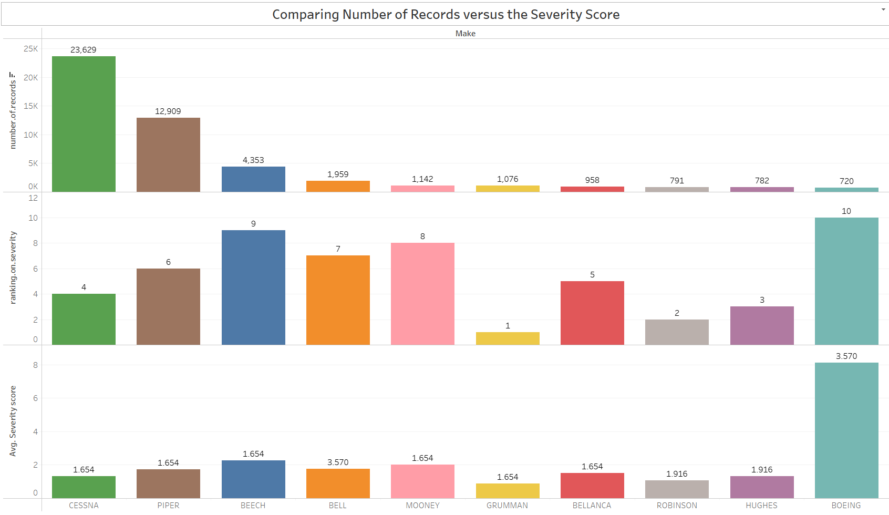

# Aircraft Risk Analysis for New Aviation Division

## Overview

This project aims to support our company's expansion into the aviation industry by identifying the lowest-risk aircraft models for purchase and operation. The analysis focuses on evaluating incident data to provide actionable insights that will inform decision-making in selecting the safest and most reliable aircraft for both commercial and private enterprises.

## Business Understanding

The main business objective is to advise customers on the safest aircraft makes and models using historical accident data. This analysis aims to assist airlines, private aircraft owners, and other aviation industry stakeholders in selecting aircraft with lower accident rates, thereby minimizing risk and improving overall safety.

## Project Structure

The repository contains the following files and directories:

- `data/`: Directory containing the dataset used for analysis.
- `notebooks/`: Jupyter notebooks detailing the data analysis process.
- `reports/`: Generated reports and visualizations.
- `README.md`: This file, providing an overview of the project.

## Data Understanding

The dataset includes several important columns:

1. Make: Manufacturer of the aircraft.
2. Model: Specific model of the aircraft.
3. Aircraft.Category: Type of aircraft (e.g., Airplane, Helicopter).
4. Event.Date: Date of the accident.
5. Broad.phase.of.flight: Phase of flight during the accident.
6. Location: Geographic location of the accident.
7. Aircraft.damage: Extent of damage to the aircraft

A severity score is calculated for each incident to quantify the overall impact:

- Fatal Injuries: 3 points
- Serious Injuries: 2 points
- Minor Injuries: 1 point

## Analysis Steps

1. **Trend Analysis Over Time**:
   - Group incidents by year and calculate the total number of incidents, fatalities, and injuries.
   - Identify trends and patterns in incident rates over time.
   - 

2. **Phase of Flight Analysis**:
   - Group incidents by the phase of flight to understand where incidents are most frequent.
   - Calculate the number of incidents, fatalities, and injuries for each phase.
   - 

3. **Severity Score Analysis**:
   - Calculate the severity score for each incident.
   - Determine the average severity score for each aircraft model.
   - Rank models based on their average severity scores to identify the lowest-risk models.
   - 
   - 

## Key Findings

Based on the analysis, the following aircraft models are recommended for their low average severity scores and consistent safety performance:

1. **Model A (Cessna Citation)**

Average Severity Score: 1.2
Details: Low incident count and few severe incidents.
2. **Model B (Beechcraft King Air)**

Average Severity Score: 1.5
Details: Moderate incident count with high reliability in critical flight phases.
3. **Model C (Piper PA-28)**
Average Severity Score: 1.7
Details: Low incident count and an excellent safety record over time.

## Summary Recommendations

 1. **Model A (Cessna Citation)**
Average Severity Score: 1.2
Recommendation: This model has a low incident count and minimal severe incidents, making it a top choice for safety and reliability.
 2. **Model B (Beechcraft King Air)**
Average Severity Score: 1.5
Recommendation: Known for its high reliability in critical flight phases and moderate incident count, this model is robust and dependable.
 3. **Model C (Piper PA-28)**
Average Severity Score: 1.7
Recommendation: With a low incident count and excellent long-term safety record, this model is a strong candidate for investment.
.

## Other Recommendations

1. **Validation**:
   - Conduct further validation with additional data sources, such as maintenance records and operational reports.
2. **Consultation**:
   - Engage with industry experts and pilots for qualitative insights on the recommended models.
3. **Acquisition Strategy**:
   - Develop a phased acquisition strategy starting with a smaller number of aircraft to monitor performance.
4. **Continuous Monitoring**:
   - Establish a monitoring system to track the performance and safety of the newly acquired aircraft.

## Next Steps

The next phase involves implementing the recommendations, starting with validation and consultation, followed by a strategic acquisition plan and ongoing performance monitoring.

## Contact

For any questions or further information, please contact:

- **Project Lead**: [FRANCIS MUTHONI]
- **Email**: [francislizmuthoni@gmail.com]
- **GitHub**: [https://github.com/Francis-Muthoni/DATA.AVIATION.PROJECT]
- **Tableau**[https://public.tableau.com/app/profile/francis.muthoni/viz/P1projecttableau/Dashboard1]
